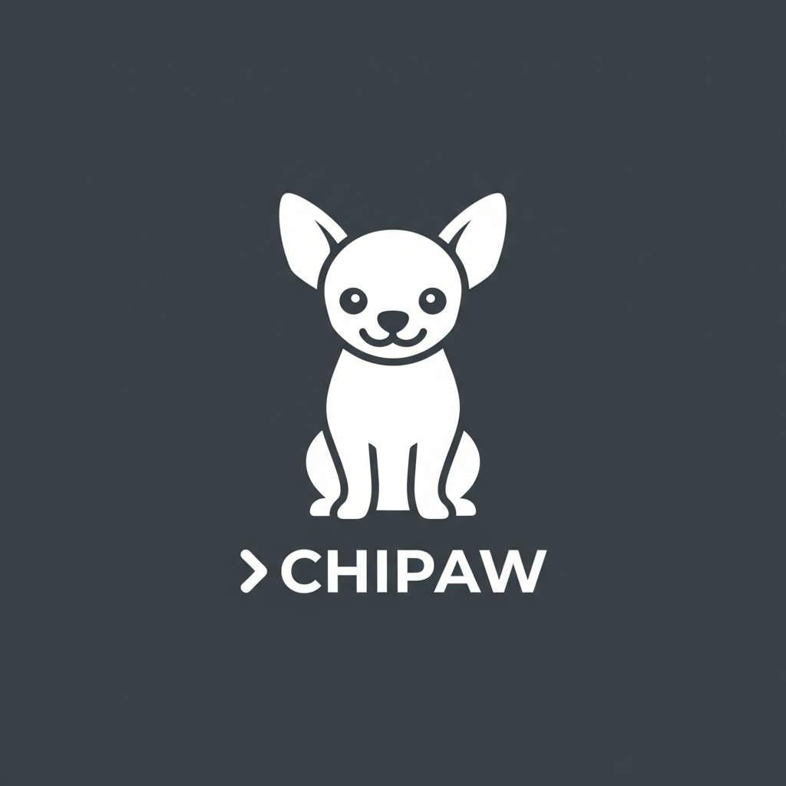

# Chico Chuwawa AI CLI - Quick Start Guide



**Built by Max van Heerden** | **Version 2.0.0**

Get started with Chico Chuwawa AI CLI in 5 minutes! Access hundreds of AI models from OpenRouter and Ollama Cloud.

## Prerequisites

- Windows PC with Python 3.7+ installed
- API key from OpenRouter or Ollama Cloud (or both!)

## Getting Your API Keys

### OpenRouter (Recommended)
1. Visit [openrouter.ai](https://openrouter.ai/)
2. Sign up (free)
3. Go to Keys → Create new key
4. Copy your key (starts with `sk-or-v1-...`)

### Ollama Cloud
1. Visit [ollama.com](https://ollama.com/)
2. Sign up
3. Go to Settings → API Keys
4. Create and copy your key

## Installation

### 1. Extract the Files

Extract to your desired location:
```
C:\Tools\chico-cli
```

### 2. Open Command Prompt

Press `Win + R`, type `cmd`, press Enter

### 3. Navigate to Folder

```bash
cd C:\Tools\chico-cli
```

### 4. Install Dependencies

```bash
pip install -r requirements.txt
```

### 5. Configure Your Provider

**For OpenRouter:**
```bash
python chico-cli.py config openrouter --api-key YOUR_OPENROUTER_KEY
```

**For Ollama Cloud:**
```bash
python chico-cli.py config ollama --api-key YOUR_OLLAMA_KEY
```

## Basic Usage

### Quick Chat

```bash
python chico-cli.py chat "What is artificial intelligence?"
```

### List Available Models

```bash
python chico-cli.py models
```

### Use Specific Model

```bash
python chico-cli.py chat "Explain Python" --model "anthropic/claude-3.5-sonnet"
```

### Interactive Chat

```bash
python chico-cli.py interactive
```

You'll see:
```
============================================================
  🐕 Chico Chuwawa AI CLI - Built by Max van Heerden
============================================================

🤖 Interactive Chat Mode
Provider: OpenRouter
Model: meta-llama/llama-3.3-70b-instruct
Type 'exit' or 'quit' to end the session

You: 
```

## Popular Models to Try

### OpenRouter Models

**Best Overall:**
```bash
python chico-cli.py chat "Your question" --model "anthropic/claude-3.5-sonnet"
python chico-cli.py chat "Your question" --model "google/gemini-2.0-flash-exp"
python chico-cli.py chat "Your question" --model "meta-llama/llama-3.3-70b-instruct"
```

**For Coding:**
```bash
python chico-cli.py chat "Write a Python function" --model "qwen/qwen-2.5-coder-32b-instruct"
```

### Ollama Cloud Models

```bash
python chico-cli.py chat "Your question" --provider ollama --model "gpt-oss:120b-cloud"
python chico-cli.py chat "Your question" --provider ollama --model "deepseek-v3.1:671b-cloud"
```

## Common Commands

| Command | Description |
|---------|-------------|
| `python chico-cli.py providers` | List all providers |
| `python chico-cli.py models` | List available models |
| `python chico-cli.py chat "message"` | Send a message |
| `python chico-cli.py interactive` | Start interactive chat |
| `python chico-cli.py switch ollama` | Switch to Ollama |
| `python chico-cli.py --help` | Show all commands |

## Tips

### 1. Use Batch File

Instead of typing `python chico-cli.py`:
```bash
chico-cli.bat chat "Hello!"
```

### 2. Set Default Model

```bash
python chico-cli.py config openrouter --api-key YOUR_KEY --default-model "anthropic/claude-3.5-sonnet"
```

### 3. Switch Providers

```bash
# Configure both
python chico-cli.py config openrouter --api-key KEY1
python chico-cli.py config ollama --api-key KEY2

# Switch between them
python chico-cli.py switch ollama
python chico-cli.py switch openrouter
```

### 4. Build Executable

```bash
python build_windows.py
```

Creates `dist/chico-cli.exe` - no Python needed!

## Troubleshooting

**"python is not recognized"**
- Install Python from [python.org](https://python.org)
- Check "Add Python to PATH" during installation

**"No API key found"**
- Run: `python chico-cli.py config openrouter --api-key YOUR_KEY`

**"Provider not configured"**
- Configure before switching: `python chico-cli.py config PROVIDER --api-key KEY`

**"Model not found"**
- List models: `python chico-cli.py models`
- Use exact model ID from the list

## Next Steps

- Read the full [README.md](README.md) for all features
- Try different models to find your favorite
- Use interactive mode for conversations
- Build the executable for easy distribution

## Quick Examples

### Example 1: Ask a Question
```bash
python chico-cli.py chat "What are the benefits of renewable energy?"
```

### Example 2: Code Generation
```bash
python chico-cli.py chat "Write a Python function to sort a list" --model "anthropic/claude-3.5-sonnet"
```

### Example 3: Creative Writing
```bash
python chico-cli.py chat "Write a short story about a robot" --model "meta-llama/llama-3.3-70b-instruct"
```

### Example 4: Interactive Conversation
```bash
python chico-cli.py interactive --model "google/gemini-2.0-flash-exp"
```

---

**You're all set!** Start chatting with Chico Chuwawa AI! 🐕✨

For detailed documentation, see [README.md](README.md)

